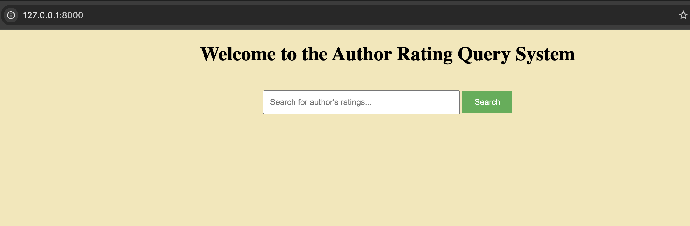
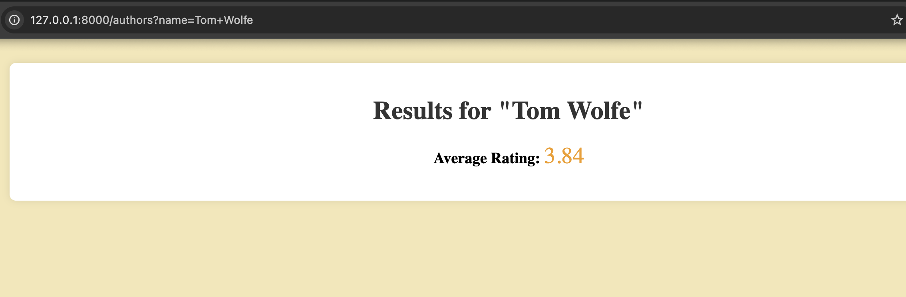
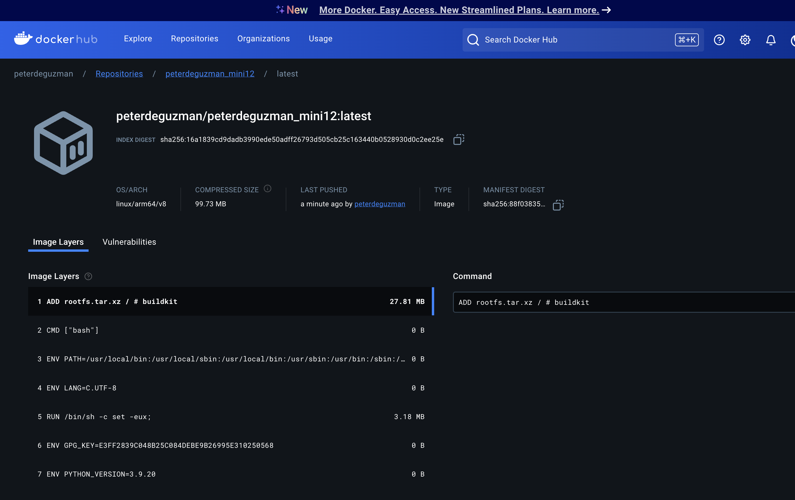
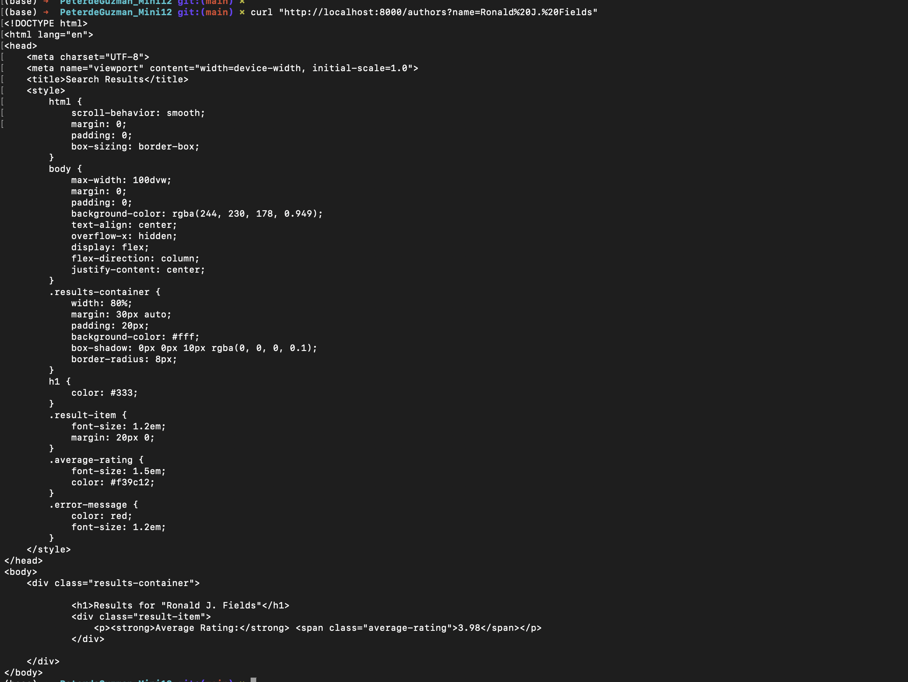

# IDS 706 Mini Project 12

## Peter de Guzman

### Status Badge

### Project Description:
This repo contains code to a simple python Flask app. containerized with a dockerfile. The goal here is to both demonstrate running your application within a docker container (using docker run terminal commands) but to also build a docker image in your CI/CD pipeline which will be pushed to Docker Hub or other container management service.

This project creates an ETL-pipeline for Goodreads Author data, connecting to a LocalStack DynamoDB database and performing CRUD operations on the database. Using the Flask app, users can query author names and receive the author's average rating from their books in the Goodreads dataset.

## Front End of the Flask App Website

## Proof of Working Flask App (created in Python)

## Proof of Upload to DockerHub (Docker Image)

## Proof of Test of Flask App

